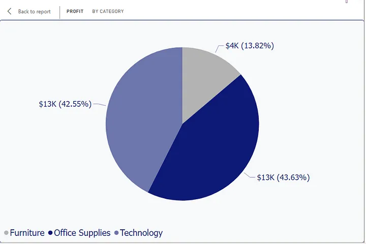
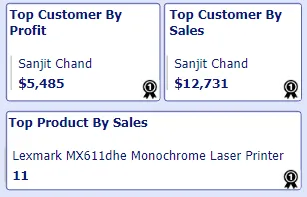
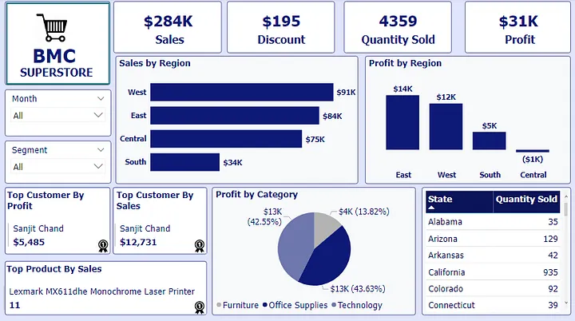

# BMC-Superstore Analysis
A Power BI project on a superstore data.

  
---
## Introduction
I worked on the sales data of **BMC Superstore** with branches in different cities in the United States.This project includes insights and recommendations for the four regions of the store and annswers business questions to enhance the efficiency of the stores. 

## Problem Statements
The task was to build a dashboard that would easily answer the following questions:
1. What was the total sales and profit made by BMC Superstore?
2. Which customer made BMC the most profit in each of the four regions?
3. Which customer made the most purchases in each region?
4. Which product was sold the most in each of the regions?

## Visualization
- The dashboard has two slicers: Month and Segment (Consumer, Corporate, Home Office)

  
    

- ### Card Visuals
---
  The four card visuals shows the total sales made by the company, discount given to customers, the quantity of goods sold and the profit made from sales.
  
  

 - ### Sales by Region
---
I used the component bar chart to show the sales made by each region. The West region had the highest sales ($91k) while the South had the lowest sales ($34k).

- ### Profit by Region
  ---
 Despite the West region making the most sales, the East region made the highest profit of $14k while the West made $12k.

 

 - ### Profit by Category
 ---
 This visual shows the profit made by each Category. The Office supplies category made the highest profit $13k which is (43.63%) of the total profit made.

  

  - ### Quantity Sold per State
---

This table shows the Quantity of goods sold in each state.

---
The text box and card visual were used to show:

- Top Customer by Profit
- Top Customer by Sales
- Top Product by Sales
   

## Dashboard
---

### West
---

### East
---

### Central
---

### South
---

From the dashboard, I was able to answer the questions listed above

1.  The total sales made by BMC was $284k while the profit made was $31k
  
2. The top customer by Profit in the four regions are:
   - West — Mary Zewe ($785)
   - East — Nathan Mautz ($2,243)
   - Central — Sanjit Chand ($4,669)
   - South — Sanjit Chand ($843)

 3. The customers that made the most purchases in each region are:
    - West — Ken Lonsdale ($8,319)
    - East — Tom Boeckenhauer ($7,000)
    - Central — Becky Martin ($10,540)
    - South — Penelope Sewall ($2,884)

 4. The product that sold the most quantity in each region are:
    - West — High Speed Automatic Electric Letter Opener (5)
    - East- HP Designjet T520 Inkjet Large Format Printer (4)
    - Central — Lexmart MX611dhe Monochrome Laser Printer (11)
    - South — GBC DocuBind TL300 Electric Binding System (3)

### Connect with me

  [Linkedin](linkedin.com/in/chibuzor-data-analyst) 
  
[Twitter](https://twitter.com/cisco_official?t=zdocHllXoG5cV__V9h0pWg&s=09)

    

  
